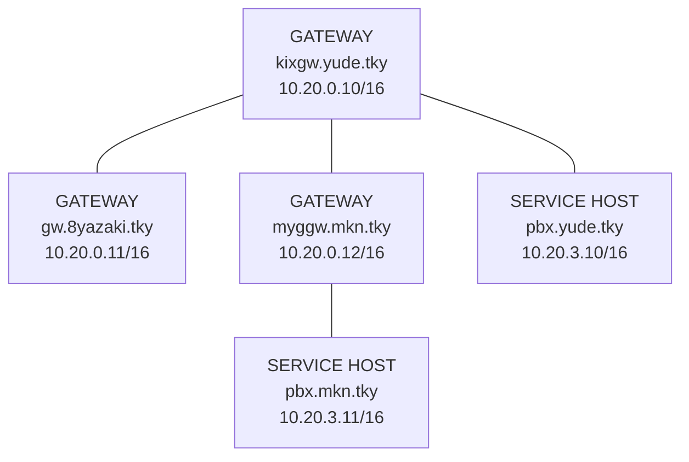

# tkynet
Tokyo Wide Area Network

```mermaid
graph TD

    %% GATEWAY
    kixgw.yude.tky[
        GATEWAY
        kixgw.yude.tky
        10.20.0.10/16
    ]
    gw.8yazaki.tky[
        GATEWAY
        gw.8yazaki.tky
        10.20.0.11/16
    ]
    myggw.mkn.tky[
        GATEWAY
        myggw.mkn.tky
        10.20.0.12/16
    ]

    kixgw.yude.tky --- gw.8yazaki.tky
    kixgw.yude.tky --- myggw.mkn.tky

    %% SERVICE HOST
    pbx.yude.tky[
        SERVICE HOST
        pbx.yude.tky
        10.20.3.10/16
    ]
    pbx.mkn.tky[
        SERVICE HOST
        pbx.mkn.tky
        10.20.3.11/16
    ]
    
    kixgw.yude.tky --- pbx.yude.tky
    myggw.mkn.tky --- pbx.mkn.tky
```